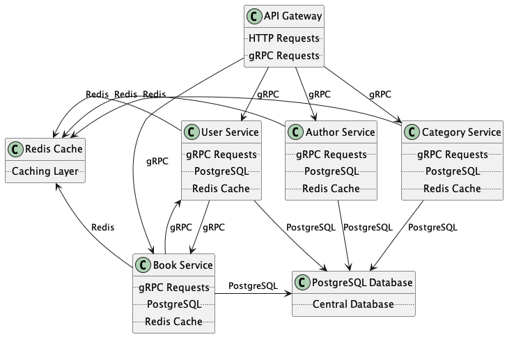
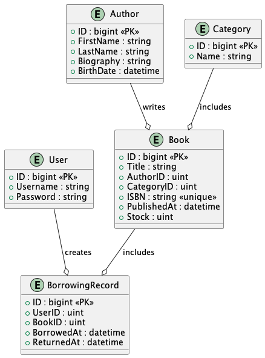

Here's a detailed README for the library management system, including how the app works and step-by-step installation instructions:

## Library Management System

This is a microservices-based library management system built using Go, gRPC, PostgreSQL and Redis. The system consists of several services that work together to manage books, categories, authors, and users.

### System Architecture



The system is composed of the following microservices:

1. Book Service
2. Category Service
3. Author Service
4. User Service
5. API Gateway

Each service is responsible for its own domain and communicates with other services using gRPC.

### How It Works

1. The API Gateway serves as the entry point for all client requests.
2. Incoming requests are routed to the appropriate microservice based on the endpoint.
3. Each microservice handles its specific domain logic and interacts with its own database.
4. Services communicate with each other using gRPC when needed.
5. Redis is used for caching to improve performance.

### Entity Relationship Diagram (ERD)



Here's a detailed explanation of each table in the ERD and their relationships:

#### Tables and Their Descriptions

1. **Book**
   - **Fields**:
     - `ID`: The unique identifier for each book (Primary Key).
     - `Title`: The title of the book.
     - `AuthorID`: The identifier for the author of the book (Foreign Key referencing the Author table).
     - `CategoryID`: The identifier for the category of the book (Foreign Key referencing the Category table).
     - `ISBN`: The International Standard Book Number, which is unique for each book.
     - `PublishedAt`: The date and time when the book was published.
     - `Stock`: The number of copies available in the library.
   - **Relationships**:
     - Each book is written by one author.
     - Each book belongs to one category.
     - A book can be borrowed by many users.

2. **Author**
   - **Fields**:
     - `ID`: The unique identifier for each author (Primary Key).
     - `FirstName`: The first name of the author.
     - `LastName`: The last name of the author.
     - `Biography`: A brief biography of the author.
     - `BirthDate`: The birth date of the author.
   - **Relationships**:
     - An author can write many books.

3. **User**
   - **Fields**:
     - `ID`: The unique identifier for each user (Primary Key).
     - `Username`: The username of the user.
     - `Password`: The password for the user.
   - **Relationships**:
     - A user can borrow many books.

4. **Category**
   - **Fields**:
     - `ID`: The unique identifier for each category (Primary Key).
     - `Name`: The name of the category.
   - **Relationships**:
     - A category can include many books.

5. **BorrowingRecord**
   - **Fields**:
     - `ID`: The unique identifier for each borrowing record (Primary Key).
     - `UserID`: The identifier for the user who borrowed the book (Foreign Key referencing the User table).
     - `BookID`: The identifier for the borrowed book (Foreign Key referencing the Book table).
     - `BorrowedAt`: The date and time when the book was borrowed.
     - `ReturnedAt`: The date and time when the book was returned.
   - **Relationships**:
     - A borrowing record is created by a user.
     - A borrowing record includes a book.

#### Relationships Between Tables

- **Author to Book**:
  - **One-to-Many Relationship**: One author can write multiple books. This is represented by the `AuthorID` foreign key in the Book table, which references the `ID` in the Author table.

- **Category to Book**:
  - **One-to-Many Relationship**: One category can include multiple books. This is represented by the `CategoryID` foreign key in the Book table, which references the `ID` in the Category table.

- **User to BorrowingRecord**:
  - **One-to-Many Relationship**: One user can create multiple borrowing records. This is represented by the `UserID` foreign key in the BorrowingRecord table, which references the `ID` in the User table.

- **Book to BorrowingRecord**:
  - **One-to-Many Relationship**: One book can be included in multiple borrowing records. This is represented by the `BookID` foreign key in the BorrowingRecord table, which references the `ID` in the Book table.

### Project Structure and Architecture

```go
library-management-system/
│
├── api-gateway/
│   ├── config/
│   │   └── config.go
│   ├── docs/
│   ├── handler/
│   │   ├── dto/
│   │   ├── middleware/
│   │   │   ├── auth.go
│   │   │   └── request_id.go
│   │   ├── auth_handler.go
│   │   ├── author_handler.go
│   │   ├── book_handler.go
│   │   ├── borrowing_record_handler.go
│   │   ├── category_handler.go
│   │   └── user_handler.go
│   ├── helper/
│   ├── .env
│   ├── go.mod
│   ├── go.sum
│   └── main.go
│
├── user-service/
│   ├── config/
│   │   └── config.go
│   ├── handler/
│   │   ├── dto/
│   │   └── user_rpc.go
│   ├── models/
│   │   └── user.go
│   ├── repository/
│   │   └── user_repository.go
│   ├── usecase/
│   │   └── user_usecase.go
│   ├── .env
│   ├── user_seed.sql
│   ├── go.mod
│   ├── go.sum
│   └── main.go
│
├── author-service/
│   ├── ...
│
├── book-service/
│   ├── ...
│
├── category-service/
│   ├── ...
│
└── borrowing-record-service/
    ├── ...
```

This project is using layered architecture pattern in organizing the codebase in a way that separates concerns and makes the system more maintainable. Here's how the different layers are represented in this project:

#### Configuration Layer (config)

Contains configuration files for your services, such as config.go for setting up database connections, environment variables, and other settings.

#### Handler Layer (handler)

Responsible for handling HTTP or RPC requests. It includes the business logic that interacts with the usecase layer to fulfill the request.
Example: auth_handler.go, user_handler.go in api-gateway, user_rpc.go in user-service.

#### DTO Layer (dto)

Encapsulates data to send it from one subsystem of an application to another.
Example: dto directory within the handler directory.

#### Middleware Layer (middleware)

Middleware functions intercept and process requests before they reach the handlers. Common tasks include authentication, logging, and request validation.
Example: auth.go, request_id.go in middleware directory of api-gateway.

#### Model Layer (models)

Defines data structures and their relationships in your application. Represents business entities.
Example: user.go in models directory of user-service.

#### Repository Layer (repository)

Provides an abstraction over the data persistence layer. Includes methods for querying and manipulating the database.
Example: user_repository.go in repository directory of user-service.

#### Usecase Layer (usecase)

Contains the business logic of the application. Defines the application's use cases and interacts with the repository layer to perform operations.
Example: user_usecase.go in usecase directory of user-service.

#### Main Entry Point (main.go)

The main.go file in each service is the entry point of the application. It initializes the service, sets up routes or RPC handlers, and starts the server.

### Installation and Setup

Follow these steps to set up and run the library management system:

#### Prerequisites

- Go 1.23 or later
- Docker and Docker Compose
- Protoc (libprotoc 27.3)
- Swagger CLI (swag version v1.16.3)

#### Step 1: Clone the Repository

```bash
git clone https://github.com/your-username/library-management.git
cd library-management
```

#### Step 2: Set Up Environment Variables

Create a `.env` file based on `.env.example` in each service directory (book-service, category-service, etc.) with the following content:

```
DB_HOST=postgres
DB_USER=your_db_user
DB_PASSWORD=your_db_password
DB_NAME=library_management
DB_PORT=5432
GRPC_PORT=50051
REDIS_PORT=6379
REDIS_HOST=redis
SERVICE_NAME=service_name
```

Replace `your_db_user`, `your_db_password`, and `service_name` with appropriate values but make sure your it is match with `.env` located in the root repo.

```
DB_USER=your_user
DB_PASSWORD=your_password
DB_NAME=your_db
DB_PORT=5432
```

#### Step 3: Generate the Proto

Run the following command to generate proto:

```bash
make gen
```

#### Step 4: Generate the Swagger Documenation

Run the following command to generate swagger documentation:

```bash
make swag
```

#### Step 5: Build and Run the Services Locally

Run the following command to build all services locally, this operation will auto migrate all table if not exists:

```bash
make build-local
```

#### Step 5: Run Seed

Run the following command to seed sample data, make sure your `.env` properly set up:

```bash
make seed
```
#### Step 6: Verify the Setup

Check if all services are running:

```bash
docker-compose ps
```

You should see all services up and running.

### API Documentation

The API documentation is available at `http://194.163.43.39:8080/swagger/index.html` when the API Gateway is running.

### Troubleshooting

- If you encounter any issues with gRPC connections, ensure that the ports are correctly mapped in the Docker Compose file.
- For database connection issues, verify that the environment variables are set correctly in each service's `.env` file.
